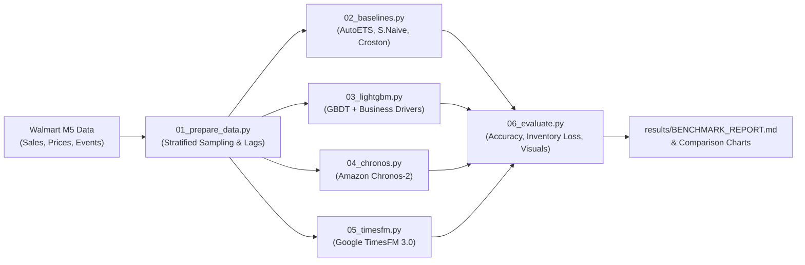

<div align="center">

# 📊 Time Series Foundation Model (TSFM) Demand Benchmark

[](https://www.python.org/)
[](https://pytorch.org/)
[%20%7C%20NVIDIA%20(CUDA)-76B900?logo=nvidia&logoColor=white)](https://developer.apple.com/metal/pytorch/)
[](tests/)
[](LICENSE)

**A reproducible, publication-grade benchmark evaluating state-of-the-art Time Series Foundation Models against Gradient Boosted Trees (LightGBM) and classical statistical baselines on the Walmart M5 demand dataset.**

[Overview](#-overview) • [Pipeline](#-benchmark-pipeline) • [Models](#-models-benchmarked) • [Quickstart](#-quickstart) • [Metrics](#-evaluation-framework) • [CLI Reference](#-cli-options)

---

</div>

## 🔍 Overview

Can zero-shot **Time Series Foundation Models (TSFMs)** replace heavily tuned **Gradient Boosted Trees (LightGBM)** in real-world retail demand forecasting?

This benchmark evaluates modern foundation models (**Google TimesFM 3.0**, **Amazon Chronos-2**) against production-standard GBDT and classical statistical baselines on Walmart M5 retail sales. It tests not just raw point accuracy, but **supply chain inventory cost**, **multi-level hierarchical aggregation**, **probabilistic uncertainty**, and **compute throughput**.

---

## 🏗️ Benchmark Pipeline



---

## 🚀 Models Benchmarked

| Model Category | Architecture | Package & Checkpoint | Key Features |
| :--- | :--- | :--- | :--- |
| **Google Foundation Model** | **TimesFM 3.0** | `timesfm3`<br>`google/timesfm-3.0-pytorch` | 330M decoder-only transformer, native future covariates, non-negative projection (`make_positive=True`), direct quantile generation. |
| **Amazon Foundation Model** | **Chronos-2** | `chronos-forecasting`<br>`amazon/chronos-2` | 120M universal forecasting transformer, group attention cross-learning, direct DataFrame ingestion (`predict_df`). |
| **Gradient Boosted Tree** | **LightGBM** | `mlforecast`<br>`lightgbm` | Recursive GBDT with promotional calendar (`event_name_1`), SNAP flags, price dynamics, and rolling window aggregations. |
| **Statistical Baselines** | **AutoETS / S.Naive / Croston** | `statsforecast` | Classical benchmarks for seasonality, exponential smoothing, and intermittent zero-inflated demand. |

---

## ⚡ Quickstart

### 1. Clone & Set Up Environment
```bash
git clone https://github.com/your-username/tsfm-demand-benchmark.git
cd tsfm-demand-benchmark

# Create virtual environment & activate
python3 -m venv .venv
source .venv/bin/activate

# Install all dependencies
pip install -r requirements.txt
```

### 2. Run the Benchmark with One Command
Execute the full benchmark using the unified CLI orchestrator:

```bash
# 🧪 Ultra-fast smoke test (~14 series, end-to-end pipeline validation in 10s)
python run_benchmark.py --preset smoke

# 📊 Standard benchmark (~168 series across all product categories)
python run_benchmark.py --preset standard

# 🎯 Isolate specific models (e.g. LightGBM vs TimesFM 3.0)
python run_benchmark.py --models lightgbm,timesfm --skip-prep

# 📈 Re-evaluate existing forecasts without re-running models
python run_benchmark.py --evaluate-only
```

### 3. Run Unit Tests
Ensure system integrity and mathematical correctness:
```bash
pytest
```

---

## 📊 Evaluation Framework

Standardized against retail supply chain best practices over a **28-day holdout horizon**:

### **1. Accuracy & Volume Metrics**
* **WAPE (Weighted Absolute Percentage Error):** Volume-weighted percentage error across all SKUs.
* **MASE (Mean Absolute Scaled Error):** Accuracy scaled relative to in-sample seasonal naive baseline ($\text{MASE} < 1.0$ indicates outperformance).
* **RMSE (Root Mean Squared Error):** Heavily penalizes large variance and severe stockout errors.

### **2. Supply Chain Financial Impact**
* **Asymmetric Inventory Loss (Newsvendor Cost):**
  $$\mathcal{L}(y, \hat{y}) = C_u \cdot \max(0, y - \hat{y}) + C_o \cdot \max(0, \hat{y} - y)$$
  Stockout / lost margin penalty ($C_u = \$3.0$) is weighted $3\times$ higher than overstock holding/markdown loss ($C_o = \$1.0$).

### **3. Hierarchical Coherence**
* **Department & Store Level WAPE:** Aggregates SKU forecasts to category and store levels to test multi-level error propagation.

### **4. Operational Efficiency & Compute**
* **Throughput:** Time series forecasted per second.
* **Latency:** Milliseconds elapsed per series ($P95$).
* **Memory Footprint:** Peak RAM and GPU/MPS memory consumption.

---

## 📈 Generated Artifacts

Execution automatically generates publication-grade outputs in `./results/`:

```
results/
├── BENCHMARK_REPORT.md         # 📋 Complete Markdown performance report with leaderboards
├── benchmark_comparison.png    # 📊 4-panel comparison bar charts (WAPE, MASE, Inv. Loss, Throughput)
├── sample_series_forecasts.png # 📈 Forecast vs. Actual overlay with shaded 80% prediction intervals
├── benchmark_summary.csv       # 🔢 Macro metric table for downstream analysis
├── per_series_summary.csv      # 🔍 Granular per-SKU performance data
├── runtime_profiles.json       # ⏱️ System latency, throughput, and hardware profiles
└── experiment_history.json     # 📜 Historical record of all experiment runs
```

---

<details>
<summary><b>🛠️ Advanced CLI Options</b></summary>

```bash
usage: run_benchmark.py [-h] [--preset {smoke,small,standard,extended}]
                        [--models MODELS] [--understock-cost UNDERSTOCK_COST]
                        [--overstock-cost OVERSTOCK_COST]
                        [--n-windows N_WINDOWS] [--skip-prep]
                        [--evaluate-only]

options:
  -h, --help            Show this help message and exit
  --preset PRESET       Dataset scale preset: smoke (~14 series), small (~56), standard (~168), extended (~525) (default: small)
  --models MODELS       Comma-separated list of models: 'all', 'baselines', 'lightgbm', 'chronos', 'timesfm' (default: all)
  --understock-cost CU  Asymmetric inventory loss penalty for lost sales / stockouts (default: 3.0)
  --overstock-cost CO   Asymmetric inventory loss penalty for excess holding / markdown (default: 1.0)
  --n-windows N         Number of backtesting evaluation windows (1 for holdout, 2-3 for rolling origin) (default: 1)
  --skip-prep           Skip data preparation if data/m5_subset.parquet already exists (default: False)
  --evaluate-only       Skip forecasting and evaluate existing result files in results/ (default: False)
```

</details>

<details>
<summary><b>📁 Project Directory Structure</b></summary>

```
tsfm-demand-benchmark/
├── 01_prepare_data.py    # Stratified M5 sampling & business covariate extraction
├── 02_baselines.py       # Seasonal Naive, AutoETS, Croston Optimized
├── 03_lightgbm.py        # LightGBM with MLForecast & rolling features
├── 04_chronos.py         # Amazon Chronos-2 zero-shot pipeline
├── 05_timesfm.py         # Google TimesFM 3.0 zero-shot pipeline
├── 06_evaluate.py        # Multi-metric evaluation, report & chart generation
├── config.py             # Central configuration & preset definitions
├── run_benchmark.py      # Unified CLI orchestrator
├── utils.py              # Math metrics, inventory loss, profiler & device detection
├── pytest.ini            # Pytest test configuration
├── tests/
│   └── test_benchmark.py # Complete 12-test unit testing suite
└── requirements.txt      # Dependency specification
```

</details>

---

## 🤝 Contributing & License

Contributions, new model integrations (e.g. Salesforce MOMENT, IBM Granite, PatchTST), and research discussions are welcome! Please submit a PR or open an issue.

Distributed under the **Apache 2.0 License**. See `LICENSE` for more information.
