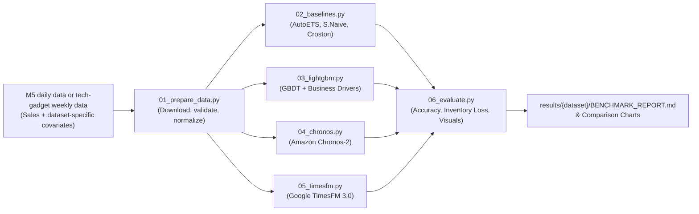

<div align="center">

# 📊 Time Series Foundation Model (TSFM) Demand Benchmark

[](https://www.python.org/)
[](https://pytorch.org/)
[%20%7C%20NVIDIA%20(CUDA)-76B900?logo=nvidia&logoColor=white)](https://developer.apple.com/metal/pytorch/)
[](tests/)

**A reproducible benchmark comparing time-series foundation models, LightGBM, and statistical baselines on Walmart M5 retail data and a tech-gadget e-commerce dataset.**

[Overview](#-overview) • [Datasets](#-datasets) • [Pipeline](#-benchmark-pipeline) • [Models](#-models-benchmarked) • [Quickstart](#-quickstart) • [Evaluation](#-evaluation-framework) • [CLI](#-cli-options)

---

</div>

## 🔍 Overview

Can zero-shot **Time Series Foundation Models (TSFMs)** replace heavily tuned **Gradient Boosted Trees (LightGBM)** in real-world retail demand forecasting?

This benchmark evaluates **Google TimesFM 3.0** and **Amazon Chronos-2** against LightGBM and statistical baselines. It supports two datasets: Walmart M5 for a large daily retail benchmark and a 44-SKU weekly tech-gadget dataset for an electronics-adjacent experiment. Results include point accuracy, illustrative inventory loss, aggregation by product hierarchy, probabilistic intervals where available, and inference throughput.

## 🗂️ Datasets

| Dataset | What it contains | Default forecast setup | Important limitation |
| :--- | :--- | :--- | :--- |
| **M5** (`--dataset m5`) | Daily Walmart item-store sales with calendar, price, and event data; a balanced subset is selected by preset | 28 days; 7-day seasonality | Broad retail rather than consumer electronics |
| **Tech gadget** (`--dataset tech_gadget`) | 44 tech-gadget SKUs × 100 weeks with weekly sales, price, homepage-feature status, color, vendor, and functionality | 13 weeks; 52-week seasonality; all 44 SKUs | One e-commerce retailer, no store/channel dimension or stock availability |

M5 is the default. Both datasets use observed unit sales as the forecasting target; neither provides enough stock-availability data to recover demand lost during stockouts. The tech-gadget CSV downloads on its first run and is cached under `data/`; its outputs are kept separate in `results/tech_gadget/`. A first run may also download pretrained model weights. The dataset authors request a citation, but the download page does not clearly state a reuse license. See the [dataset notes](#tech-gadget-dataset-notes) before redistributing it.

---

## 🏗️ Benchmark Pipeline



---

## 🚀 Models Benchmarked

| Model Category | Architecture | Package & Checkpoint | Key Features |
| :--- | :--- | :--- | :--- |
| **Google Foundation Model** | **TimesFM 3.0** | `timesfm3`<br>`google/timesfm-3.0-pytorch` | 330M decoder-only transformer, native future covariates, non-negative projection (`make_positive=True`), direct quantile generation. |
| **Amazon Foundation Model** | **Chronos-2** | `chronos-forecasting`<br>`amazon/chronos-2` | 120M universal forecasting transformer, group attention cross-learning, direct DataFrame ingestion (`predict_df`). |
| **Gradient Boosted Tree** | **LightGBM** | `mlforecast`<br>`lightgbm` | Recursive GBDT with lags, rolling features, and available dataset-specific drivers (M5 calendar/events/prices or gadget prices/feature flag). |
| **Statistical Baselines** | **AutoETS / S.Naive / Croston** | `statsforecast` | Classical benchmarks for seasonality, exponential smoothing, and intermittent zero-inflated demand. |

---

## ⚡ Quickstart

### 1. Clone & Set Up Environment
```bash
git clone https://github.com/Ganesh-K-Indium/tsfm-demand-benchmark.git
cd tsfm-demand-benchmark

# Create virtual environment & activate
python3 -m venv .venv
source .venv/bin/activate

# Install all dependencies
pip install -r requirements.txt
```

### 2. Run the Benchmark with One Command
Execute the full benchmark using the unified CLI orchestrator:

```bash
# 🧪 Small M5 pipeline smoke run (~14 product-store series)
python run_benchmark.py --preset smoke

# 📊 Standard benchmark (~168 series across all product categories)
python run_benchmark.py --preset standard

# 🔌 Run all models on the tech-gadget dataset (44 weekly SKU series)
python run_benchmark.py --dataset tech_gadget

# 🎯 Re-run selected models on an already-prepared tech-gadget dataset
python run_benchmark.py --dataset tech_gadget --models lightgbm,timesfm --skip-prep

# 📈 Re-evaluate existing forecasts without re-running models
python run_benchmark.py --evaluate-only
```

### 3. Run Unit Tests
Ensure system integrity and mathematical correctness:
```bash
pytest
```

---

## 🪟 How the holdout works

A holdout is the final period hidden from a model and used only to score its forecasts. For M5, the default forecast covers the final 28 days. For tech gadget, it covers the final 13 weeks. `--n-windows 1` evaluates one such period; larger values create multiple rolling forecast origins so results can be compared across periods. Every model in a run uses the same cutoff dates.

Example: `python run_benchmark.py --dataset tech_gadget --n-windows 1` trains through 25 June 2018 and forecasts the 13 weeks through 24 September 2018. The source includes price and homepage-feature values during the holdout; the experiment treats these as known in advance, so that assumption should be reviewed before interpreting results operationally.

## 📊 Evaluation Framework

Evaluation uses a 28-day daily horizon for M5 and a 13-week horizon for the tech-gadget dataset:

### **1. Accuracy & Volume Metrics**
* **WAPE (Weighted Absolute Percentage Error):** Volume-weighted percentage error across all SKUs.
* **MASE (Mean Absolute Scaled Error):** Accuracy scaled relative to in-sample seasonal naive baseline ($\text{MASE} < 1.0$ indicates outperformance).
* **RMSE (Root Mean Squared Error):** Heavily penalizes large variance and severe stockout errors.

### **2. Supply Chain Financial Impact**
* **Asymmetric Inventory Loss (Newsvendor Cost):**
  $$\mathcal{L}(y, \hat{y}) = C_u \cdot \max(0, y - \hat{y}) + C_o \cdot \max(0, \hat{y} - y)$$
  Stockout / lost margin penalty ($C_u = \$3.0$) is weighted $3\times$ higher than overstock holding/markdown loss ($C_o = \$1.0$).

### **3. Hierarchical Coherence**
* **Hierarchy WAPE:** Aggregates M5 SKU forecasts to department/store levels and gadget forecasts to functionality/vendor levels.

### **4. Operational Efficiency & Compute**
* **Throughput:** Time series forecasted per second.
* **Latency:** Average measured milliseconds per series during the inference block; model download and most initialization are excluded.
* **Memory Footprint:** Approximate peak process RAM (RSS); accelerator-specific allocations may not be fully captured.

---

## 📈 Generated Artifacts

Execution automatically generates outputs in `./results/m5/` for M5 and `./results/tech_gadget/` for the gadget dataset:

```
results/
├── m5/                         # M5 forecasts, reports, charts, summaries, and runtime profiles
└── tech_gadget/                # Tech-gadget forecasts and corresponding outputs
```

---

<details>
<summary><b>🛠️ Advanced CLI Options</b></summary>

```bash
usage: run_benchmark.py [-h] [--preset {smoke,small,standard,extended}]
                        [--dataset {m5,tech_gadget}]
                        [--models MODELS] [--understock-cost UNDERSTOCK_COST]
                        [--overstock-cost OVERSTOCK_COST]
                        [--n-windows N_WINDOWS] [--skip-prep]
                        [--evaluate-only]

options:
  -h, --help            Show this help message and exit
  --preset PRESET       Dataset scale preset: smoke (~14 series), small (~56), standard (~168), extended (~525) (default: small)
  --dataset DATASET     Dataset: M5 daily retail or tech_gadget weekly retail (default: m5)
  --models MODELS       Comma-separated list of models: 'all', 'baselines', 'lightgbm', 'chronos', 'timesfm' (default: all)
  --understock-cost CU  Asymmetric inventory loss penalty for lost sales / stockouts (default: 3.0)
  --overstock-cost CO   Asymmetric inventory loss penalty for excess holding / markdown (default: 1.0)
  --n-windows N         Number of backtesting evaluation windows (1 for holdout, 2-3 for rolling origin) (default: 1)
  --skip-prep           Skip preparation if the selected dataset parquet already exists (default: False)
  --evaluate-only       Evaluate existing forecasts in the selected dataset's results folder (default: False)
```

</details>

The M5 `--preset` controls the sampled subset. The tech-gadget option always uses all 44 SKUs; `--preset` does not change that dataset. Select `--dataset tech_gadget` whenever using `--skip-prep` or `--evaluate-only` so the runner reads the matching prepared data and forecasts.

### Tech-gadget dataset notes

`--dataset tech_gadget` downloads the authors' raw CSV from the [Demand Prediction in Retail dataset page](https://demandprediction.github.io/dataset.html), validates its SKU/week panel, and saves the normalized data to `data/tech_gadget.parquet`. The authors report 44 tech-gadget SKUs with 100 weekly observations each (October 2016–September 2018), including sales, price, homepage-feature status, color, vendor, and functionality. The pipeline uses all 44 series, a 13-week forecast horizon, and 52-week seasonal scaling; it saves outputs under `results/tech_gadget/`.

Price and homepage-feature flags during the holdout are treated as known future values. The dataset does not provide historical plan vintages, so this assumes the values were available at forecast time. The raw source's color value changes within some SKU histories, so color is retained for inspection but excluded as a static model feature. The dataset page asks users to cite Cohen, Gras, Pentecoste, and Zhang (2022), *Demand Prediction in Retail: A Practical Guide to Leverage Data and Predictive Analytics*. It does not state a clear reuse license; verify terms before redistributing the raw data or derived files.

<details>
<summary><b>📁 Project Directory Structure</b></summary>

```
tsfm-demand-benchmark/
├── 01_prepare_data.py    # Download/prepare M5 or tech-gadget data
├── 02_baselines.py       # Seasonal Naive, AutoETS, Croston Optimized
├── 03_lightgbm.py        # LightGBM with MLForecast & rolling features
├── 04_chronos.py         # Amazon Chronos-2 zero-shot pipeline
├── 05_timesfm.py         # Google TimesFM 3.0 zero-shot pipeline
├── 06_evaluate.py        # Multi-metric evaluation, report & chart generation
├── config.py             # Central configuration & preset definitions
├── run_benchmark.py      # Unified CLI orchestrator
├── utils.py              # Math metrics, inventory loss, profiler & device detection
├── pytest.ini            # Pytest test configuration
├── tests/
│   └── test_benchmark.py # Complete 12-test unit testing suite
└── requirements.txt      # Dependency specification
```

</details>

---

## 🤝 Contributing & License

Contributions, new model integrations (e.g. Salesforce MOMENT, IBM Granite, PatchTST), and research discussions are welcome. Please submit a pull request or open an issue.

This repository currently has no root `LICENSE` file. Confirm the project license before redistributing or reusing the code outside the repository.
